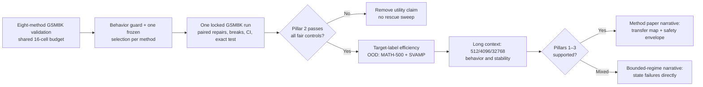

# Major-Revision Contribution Strengthening Plan

**Status:** Historical pre-outcome planning document.  The frozen evidence chain is complete and does not support the conditional positive steering story described below.  The active narrative is the bounded diagnostic/controlled-audit story in `revision/FINAL_CLAIM_AUDIT.md`, `revision/RESPONSE_LETTER_DRAFT.md`, and `paper/TACL_READINESS_STATUS.md`.

## Purpose

This document fixes the **strongest defensible story** for the TACL revision
before any locked-test result is opened.  It answers a practical problem: we
will not try to save the paper by reporting the best seed, a post-hoc layer, or
a favorable source/target pair.  Instead, the paper earns a stronger claim only
when the whole frozen evidence chain supports it.

The June 1 submission proposed three linked ideas:

1. post-training leaves measurable differences in reasoning trajectories;
2. those measurements can be used for candidate selection (GeoVote);
3. a source-model trajectory direction can be injected into a target model
   (CrossSteer) to improve its answers.

The action editor kept the paper alive because this full-trajectory viewpoint
is promising, but asked us to establish whether the apparent utilities survive
length controls, fair steering baselines, OOD evaluation, and long contexts.
The revision should therefore become **more rigorous and more informative**,
not merely more cautious.

## The strongest viable central contribution

If the frozen protocol succeeds, the revised paper will make the following
single, coherent claim:

> **A correctness-associated direction estimated from complete hidden-state
> reasoning trajectories can act as a source-derived, target-label-free
> inference-time control signal.  Under a stated compatibility regime, it
> improves a target model more than equally budgeted single-state and sparse
> steering alternatives, without relying on a trivial length or repetition
> change.**

This is stronger than a plot-level claim that models "look different": it is a
controlled **functionality claim** about when a full trajectory supplies usable
information that a conventional steering vector misses.  It is deliberately
not a claim that geometry is a universal causal mechanism or a universal model
fingerprint.

The diagnosis analysis serves this central claim in a precise role: it
identifies an *orientation/compatibility hypothesis* before intervention.  It
does not by itself prove a mechanism.

## Three contribution pillars and their evidence contracts

### Pillar 1 — Measurable post-training trajectory structure

**What we want to establish.**  With the same prompt, extractor, layer grid,
and evaluation rule, post-training variants show reproducible differences in
how trajectory statistics align with correct versus incorrect completions.

**What would make this meaningful rather than a decorative heatmap.**

- report every metric--layer cell, bootstrap uncertainty, generation-length
  distributions, and model capability context;
- distinguish a *checkpoint-level association pattern* from a universal
  fingerprint or explanation of reasoning;
- include confidence, length, and text/behavior controls wherever correctness
  prediction is discussed;
- use the diagnostic pattern only as a pre-specified compatibility cue, never
  as a result-conditioned way to select a winning layer or model.

**Claim threshold.**  A stable fixed-protocol, within-family association is
sufficient for this descriptive pillar.  Cross-family universality, nearest
neighbor topology, and a causal geometric interpretation require separate
positive evidence and are not implied here.

**Reviewer concern addressed.**  Reviewer A's request for separable signatures
and Reviewer B's concern that "different geometry" must be more than a
scale/length artifact.

### Pillar 2 — Full trajectory gives a fair intervention advantage

**What we want to establish.**  CrossSteer is not simply producing longer,
more repetitive, or differently formatted answers.  Its full-trajectory
source direction produces paired answer repairs on a held-out target set.

**Required evidence, all mandatory.**

1. Every method receives the same source IDs, target model, prompt, evaluator,
   decode budget, layer/strength grid, behavior guard, validation IDs, and
   locked GSM8K IDs.
2. The locked comparison includes no steering, exact sign reversal,
   matched-norm random direction, target-calibrated direction, CAA, ActAdd,
   SAE-space sparse activation steering, and the declared coordinate-sparse
   CAA ablation.
3. The selected CrossSteer configuration has a positive paired locked delta
   whose 95% bootstrap lower bound is above zero and whose exact paired test is
   reported; repairs and breaks are both shown.
4. Its advantage cannot be explained by a behavior failure: the selected cell
   must pass the repeated-4-gram and mean-length guards, and the report must
   include answer-marker, stop, length, and textual-overlap diagnostics.
5. The comparison must show an advantage over the declared conventional and
   sparse baselines under the same protocol—not merely over no steering.

**Strengthened interpretation if this passes.**  The contribution is not "any
activation direction can help."  It is that *source-model, time-distributed
correctness evidence* is a competitive way to construct a steering direction
when target correctness labels are not available.

**Reviewer concern addressed.**  The action editor's mandatory baseline and
length-control request; Reviewer B's question of whether computing full
trajectories offers a benefit beyond traditional steering.

### Pillar 3 — The effect has a usable boundary, not a cherry-picked cell

**What we want to establish.**  The paper explains the operating regime of the
intervention: when it transfers, when it fails, and whether it remains useful
outside the original held-out set and decoder length.

**Required evidence.**

- **Target-label efficiency:** compare source-only CrossSteer with a
  target-calibrated direction at declared target-label budgets.  The practical
  claim is strongest when source-only transfer is useful in the low/zero-target
  label regime; we must not call it dominant when abundant target labels are
  available.
- **OOD:** freeze the selected GSM8K configuration and apply it to MATH-500 and
  SVAMP without selecting another layer, alpha, sign, schedule, prompt, or
  metric.  Show all cells, including failures.
- **Long context:** run the declared 512/4096/32768 schedules and report
  accuracy together with truncation, repetition, output length, and stop
  reason.  A mitigation is not credited if it only avoids looping by reducing
  task accuracy below the unsteered baseline.
- **Source/target compatibility:** report positive, neutral, and negative
  source/target outcomes together with the fixed-protocol diagnostic evidence.
  A compatibility pattern may be called predictive only if it is evaluated on
  held-out pairings; otherwise call it a retrospective association.

**Strengthened interpretation if this passes.**  The revised paper contributes
a *transfer map and safety envelope*: full-trajectory steering is useful under
particular compatibility and context conditions, while sign reversal,
incompatible sources, and long-context loops are explicit negative controls.
This is a meaningful method contribution because it tells users when the
intervention should and should not be deployed.

**Reviewer concern addressed.**  Reviewer B's OOD request and the action
editor's long-context stability requirement.

## What happens under each evidence outcome

| Frozen evidence outcome | Paper-level decision | Permitted main conclusion |
|---|---|---|
| All three pillars pass | Retain all three linked contributions and foreground the fair locked CrossSteer result. | Full-trajectory source transfer is an effective, bounded inference-time control method; diagnostics provide compatibility evidence. |
| Pillars 1 and 2 pass, but OOD/long context are mixed | Retain an in-domain method result, make the operating boundary a central result, and report failures prominently. | Effective in the tested regime, with explicitly bounded transfer and context scope. |
| Pillar 1 passes but Pillar 2 fails against fair controls | Do not claim a new steering method.  Keep diagnostics only if the controlled association is stable; GeoVote remains a negative control. | Descriptive trajectory analysis under a fixed protocol, not inference-time improvement. |
| Pillar 1 itself does not survive the controlled audit | Remove the signature/generalization claim and do not try a new post-hoc metric. | No positive geometry claim; revise around only independently validated content, if any. |

No row permits selective seed reporting, post-locked hyperparameter changes,
or hiding a source/target failure.  The same reviewers will see the response,
so auditability is part of the scientific contribution and the credibility of
the revision.

## Frozen execution sequence

## Historical execution status — superseded by final evidence

At the time this planning document was written, the eight-method validation
family was still being completed.  That execution has since finished.  The
final locked, OOD, label-budget and long-context outcomes are reported in the
frozen evidence manifests and summarized in `revision/FINAL_CLAIM_AUDIT.md`.
The final paper does not use the conditional positive method story below; it
uses the bounded diagnostic and controlled-audit narrative supported by the
completed evidence.

## Document links

- Exact editor obligations: `revision/EDITOR_REQUIREMENTS.md`
- All reviewer issues and owner/evidence mapping: `revision/REVIEWER_COMMENT_TRACKER.md`
- Claim-by-claim wording constraints: `revision/CLAIM_REVISION_MAP.md`
- Frozen experiment design: `revision/EXPERIMENT_MATRIX.md` and
  `revision/VALIDATION_GRID_V1.md`
- Statistical rules: `revision/STATISTICAL_ANALYSIS_PLAN.md`
- Final evidence and claim audit: `revision/FINAL_CLAIM_AUDIT.md`
